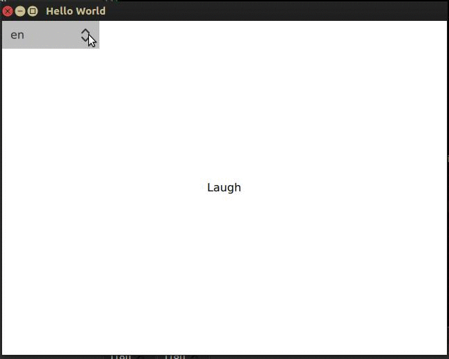

# Qt5.10 多语言动态翻译

* 不需要重启程序 *


### 编译运行


###  翻译步骤整理
1. qml 中使用qsTr 标记要翻译的文本

2. 在pro中添加翻译文件ts,例如：
```
TRANSLATIONS += I18n_zh.ts \
        I18n_en.ts
```
3. 使用lupdate （通过命令行，或者qtcreator->Tools->External->Linguist->lupdate），会在源码路径下生成ts文件

4. 使用linguist （Qt5.10.0/5.10.0/gcc_64/bin/linguist）导入ts文件，进行翻译

5. 使用lrelease，（通过命令行，qtcreator 或者 linguist）,生成qm文件。

ts文件是xml格式的文本，qm文件是对其压缩过的二进制格式。两者都可以使用linguist导入

6. qm文件放入运行路径，或者加入qrc资源

7. 使用QTranslator加载qm文件并安装

```
#pragma once

#include <QObject>
#include <QTranslator>
#include <QMap>
#include <QCoreApplication>
#include <QDebug>
class I18n: public QObject{
    Q_OBJECT
public:
    I18n(QObject *parent = 0) : QObject(parent) {
        QTranslator *en = new QTranslator(this);
        QTranslator *cn = new QTranslator(this);
        bool ret = en->load("I18n_en.qm");
        qWarning() << ret;
        ret = cn->load("I18n_zh.qm");
        qWarning() << ret;
        mTrans["en"] = en;
        mTrans["zh"] = cn;
    }
    Q_INVOKABLE void reTrans(const QString &lan) {
        if (mTrans.contains(lan)) {
            if (!mLastLan.isEmpty()) {
                QCoreApplication::removeTranslator(mTrans[mLastLan]);
            }
            mLastLan = lan;
            QCoreApplication::installTranslator(mTrans[mLastLan]);
            emit retransRequest();
            qWarning() << "retrans" << lan;
        }
    }
signals:
    void retransRequest();
private:
    QMap<QString, QTranslator *> mTrans;
    QString mLastLan;
};
```

8. 在需要切换语言的地方，调用reTrans，并触发QQmlEngine::retranslate

```
#include <QGuiApplication>
#include <QQmlApplicationEngine>
#include <QQmlContext>
#include "I18n.hpp"
int main(int argc, char *argv[])
{
#if defined(Q_OS_WIN)
    QCoreApplication::setAttribute(Qt::AA_EnableHighDpiScaling);
#endif

    QGuiApplication app(argc, argv);
    I18n i18n;
    QQmlApplicationEngine engine;
    QObject::connect(&i18n, &I18n::retransRequest, &engine, &QQmlApplicationEngine::retranslate);

    engine.rootContext()->setContextProperty("i18n", &i18n);
    engine.load(QUrl(QStringLiteral("qrc:/main.qml")));
    if (engine.rootObjects().isEmpty())
        return -1;

    return app.exec();
}
```

